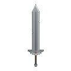

# Sparta_Adventure
[Unity 9기] 스파르타 던전 탐험 만들기

How To Play

이동

상: W, 하: S, 좌: A, 우: D
점프 Space_bar

단축키

인벤토리 : E
상호작용 및 습득 : F
공격 : 좌클릭
원거리 공격 : 우클릭 //원거리 무기 (돌)을 장착했을때만 사용가능
대쉬 : L쉬프트 (키다운)

아이템

무기 아이템
검

돌

소비 아이템
당근 : 소모시 3초간 체력: 10 회복 스테미너: 10 회복

오브젝트
불 : 닿을 시 높게 점프됨 데미지 30

